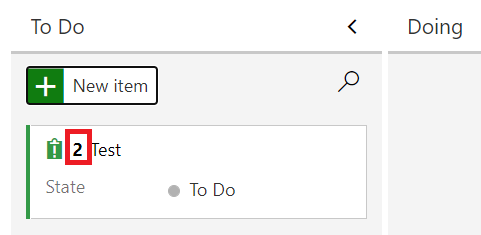
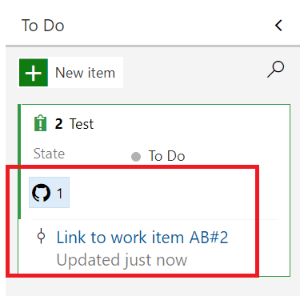
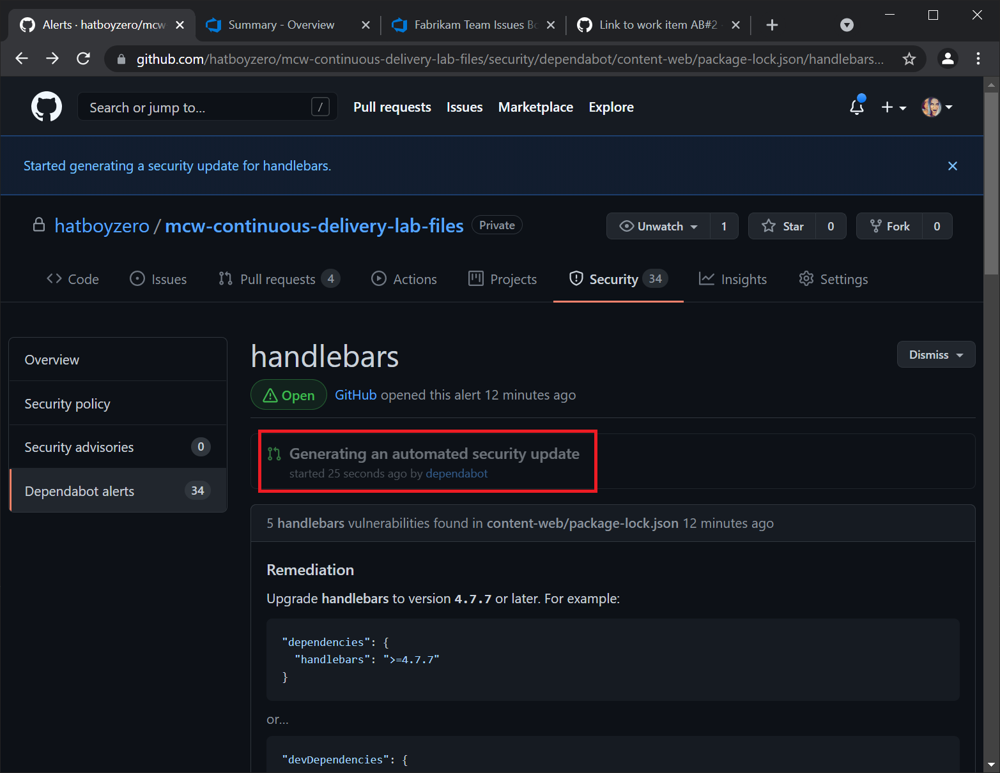
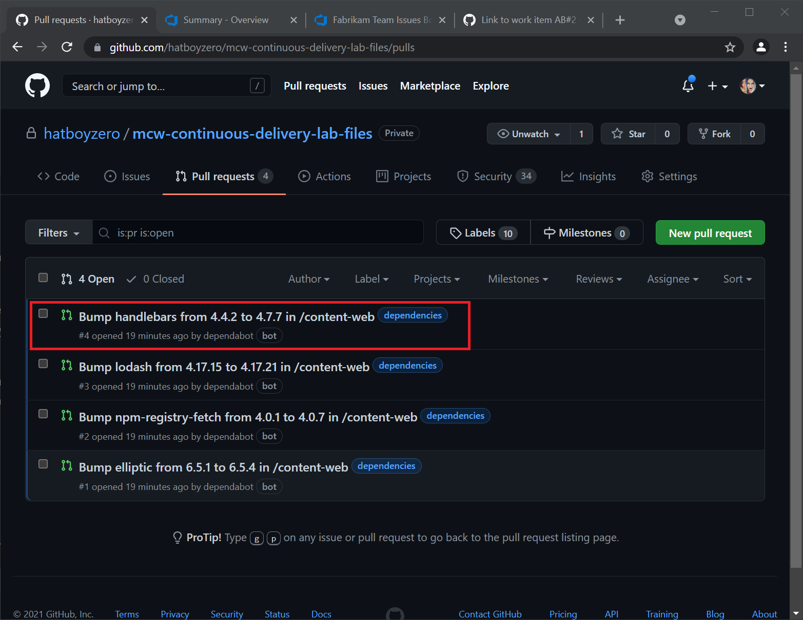
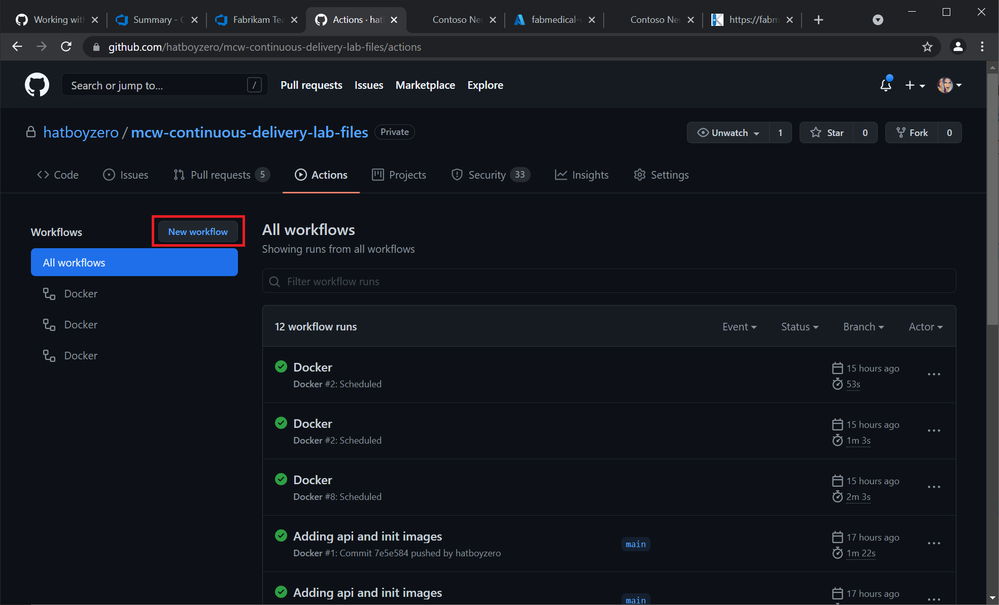

<div class="MCWHeader1">
Continuous Delivery
</div>

<div class="MCWHeader2">
Hands-on lab step-by-step
</div>

<div class="MCWHeader3">
June 2021
</div>


Information in this document, including URL and other Internet Web site references, is subject to change without notice. Unless otherwise noted, the example companies, organizations, products, domain names, e-mail addresses, logos, people, places, and events depicted herein are fictitious, and no association with any real company, organization, product, domain name, e-mail address, logo, person, place or event is intended or should be inferred. Complying with all applicable copyright laws is the responsibility of the user. Without limiting the rights under copyright, no part of this document may be reproduced, stored in or introduced into a retrieval system, or transmitted in any form or by any means (electronic, mechanical, photocopying, recording, or otherwise), or for any purpose, without the express written permission of Microsoft Corporation.

Microsoft may have patents, patent applications, trademarks, copyrights, or other intellectual property rights covering subject matter in this document. Except as expressly provided in any written license agreement from Microsoft, the furnishing of this document does not give you any license to these patents, trademarks, copyrights, or other intellectual property.

The names of manufacturers, products, or URLs are provided for informational purposes only and Microsoft makes no representations and warranties, either expressed, implied, or statutory, regarding these manufacturers or the use of the products with any Microsoft technologies. The inclusion of a manufacturer or product does not imply endorsement of Microsoft of the manufacturer or product. Links may be provided to third party sites. Such sites are not under the control of Microsoft and Microsoft is not responsible for the contents of any linked site or any link contained in a linked site, or any changes or updates to such sites. Microsoft is not responsible for webcasting or any other form of transmission received from any linked site. Microsoft is providing these links to you only as a convenience, and the inclusion of any link does not imply endorsement of Microsoft of the site or the products contained therein.

© 2019 Microsoft Corporation. All rights reserved.

Microsoft and the trademarks listed at <https://www.microsoft.com/en-us/legal/intellectualproperty/Trademarks/Usage/General.aspx> are trademarks of the Microsoft group of companies. All other trademarks are property of their respective owners.

**Contents** 

<!-- TOC -->

- [Continuous Delivery - hands-on lab step-by-step](#continuous-delivery-hands-on-lab-step-by-step)
    - [Abstract and learning objectives](#abstract-and-learning-objectives)
    - [Overview](#overview)
    - [Solution architecture](#solution-architecture)
    - [Requirements](#requirements)
    - [Before the hands-on lab](#before-the-hands-on-lab)
    - [Exercise 1: Continuous Integration](#exercise-1-continuous-integration)
        - [Task 1: Connect Azure Board with GitHub](#task-1-connect-azure-board-with-github)
        - [Task 2: Using Dependabot](#task-2-using-dependabot)
        - [Task 3: Set up Local Infrastructure](#task-3-set-up-local-infrastructure)
        - [Task 4: Build Automation with GitHub Registry](#task-4-build-automation-with-github-registry)
    - [Exercise 2: Continuous Delivery](#exercise-2-continuous-delivery)
        - [Task 1: Set up Cloud Infrastructure](#task-1-set-up-cloud-infrastructure)
        - [Task 2: Deployment Automation to Azure Web App](#task-2-deployment-automation-to-azure-web-app)
    - [Exercise 3: Monitoring and Logging in Azure](#exercise-3-monitoring-and-logging-in-azure)
        - [Task 1: Set up Application Insights](#task-1-set-up-application-insights)
        - [Task 2: Continuous Deployment with GitHub Actions](#task-2-continuous-deployment-with-github-actions)
        - [Task 3: Continuous Deployment with Azure DevOps Pipelines](#task-3-continuous-deployment-with-azure-devops-pipelines)
    - [After the hands-on lab](#after-the-hands-on-lab)
        - [Task 1: Tear down Azure Resources](#task-1-tear-down-azure-resources)

<!-- /TOC -->

# Continuous Delivery - hands-on lab step-by-step 

## Abstract and learning objectives 

This workshop is targeted for students in an instructor-led training session.  

## Overview

Fabirkam Medical Conferences provide conference website services tailored to the medical community. Over the course of ten years, they have built conference sites for a small conference organizer. Through word of mouth, Fabrikam Medical Conferences has become a well-known industry brand handling over 100 conferences per year and growing.

Medical conferences typically have between 100 and 1500 attendees; as such, they typically have relatively low budgets allocated for web site development and hosting.  At the same time, the customization ands of live sites. Such demands can impact aspects of live sites from end to end, ranging from UI to backend concerns as well as concerns around conference registration and payment functionality.

## Solution architecture

\[Insert your end-solution architecture here. . .\]

## Requirements

1.  Microsoft Azure subscription must be pay-as-you-go or MSDN.

  - Trial subscriptions will _not_ work

  - To complete this lab setup, ensure your account includes the following:

    - Has the [Owner](https://docs.microsoft.com/azure/role-based-access-control/build-in-roles#owner) built-in role for the subscription you use.

    - Is a [Member](https://docs.microsoft.com/azure/active-directory/fundamentals/users-default-permissions#member-and-guest-users) user in the Azure AD tenant you use. (Guest users will not have the necessary permissions.)

2. A Microsoft [GitHub](https://github.com) account.

3. Local machine or a virtual machine configured with:

    - A browser, preferably Chrome for consistency with the lab implementation tests.

4. Git for Windows

5. Powershell

6. Docker Desktop for Windows

## Before the hands-on lab

Refer to the Before the hands-on lab setup guide manual before continuing to the lab exercises.

## Exercise 1: Continuous Integration

Duration: 40 minutes

After a requirements gathering effort, we find that Fabrikam Medical Conferences has many areas of potential improvement in their development workflow.  Specifically, we conclude that there are a lot of manual tasks that can be automated, potentially mitigating many of the recurring quality and security issues as well as reducing the dependencies between Fabrikam's developers and their work and productivity. We will begin to address some of these efforts in this exercise with the objective of improving developer flow and establishing continuous integration practices.

### Task 1: Connect Azure Board with GitHub

1.  On the GitHub Marketplace, find the [Azure Boards Integration App](https://github.com/marketplace/azure-boards)

    

2. Scroll to the bottom of the page and select `Install it for Free`.

3. On the next page, select `Complete order and begin installation`.

4. Select the lab files repository created in [Task 1 of the Before the HOL Instructions] and click `Install & Authorize`.

    

5. Select the Azure DevOps organization you signed into or created in the Before Hands-On Lab setup guide and select the Fabrikam project.

    

6. When the integration succeeds, you will be taken to the Azure DevOps Board. Select `Skip` in the lower right of the onboarding tutorial for Azure DevOps Boards.

7. In the Azure DevOps Board for the Fabrikam project, create an issue called `Test`. Note the `Work Item ID` that is assigned when you save the work item.

    

8. In the root folder of the lab files repository, create a `README.md` file with the following contents.

    ```
    # Fabrikam
    ```

9. Add the `README.md` file to the Git repository and commit and push the change with a message that contains the Azure DevOps Boards work item ID we retrieved in step 7, in the following format AB#WorkItemID.

    ```pwsh
    cd C:\Workspaces\lab\mcw-continuous-delivery-lab-files  # This path may vary depending on how
                                                            # you set up your lab files repository
    git add README.md
    git commit -m "Link to work item AB#2"
    git push
    ```

10. In Azure DevOps Boards, find the work item and observe that the code commit has been linked to the work item.

    

### Task 2: Using Dependabot

1.  In your lab files GitHub repository, navigate to the `Security` tab.  Click on the `Enable Dependabot alerts` button.

    

2. You should arrive at the `Security & analysis` blade under the `Settings` tab. Enable `Dependabot alerts` and `Dependabot security updates`.

    > **Note**: Enabling `Dependabot alerts` will also automatically enable `Dependency graph`.

    

3. To observe Dependabot issues, navigate to the `Security` tab and select the `View Dependabot alerts` link. You should arrive at the `Dependabot alerts` blade in the `Security` tab.

    

4. Scroll through the list of Dependabot alerts until you find the `handlebars` vulnerability.  

    

5. Click on the `handlebars` Dependabot alert title to see the alert detail. After reviewing the alert, click on the `Create Dependabot security update` button and wait a few moments for GitHub to create the security update.

    

    

6. In the `Pull Requests` tab, find the Dependabot security patch pull request and merge it to your main branch.

    

    

7. Pull the latest changes from your GitHub repository to your local GitHub folder.

    ```pwsh
    cd C:\Workspaces\lab\mcw-continuous-delivery-lab-files  # This path may vary depending on how
                                                            # you set up your lab files repository
    git pull
    ```

### Task 3: Set up Local Infrastructure

1. Replace instances of `<yourgithubaccount>` with your GitHub account name in the following files located in the root of your lab files repository.
    - `docker-compose.init.yml`
    - `docker-compose.yml`

2. Build and run the docker-compose YAML files edited in the previous step.

    ```pwsh
    docker-compose -f .\docker-compose.yml -f .\local.docker-compose.yml -f .\docker-compose.init.yml build
    docker-compose -f .\docker-compose.yml -f .\local.docker-compose.yml -f .\docker-compose.init.yml up
    ```

3. Verify that you can browse to http://localhost:3000 in a browser and arrive at the Fabrikam conference website.

    

    

4. Commit and push your changes to your GitHub repository.

### Task 4: Build Automation with GitHub Registry

1. Select the `Settings` tab from your lab files repository in GitHub

2. Select the `Secrets` blade from the left navigation bar.

    

3. Select the `New repository secret` button.

    

4. Enter the name `CR_PAT` in the `New secret` form and set the GitHub Personal Access Token we created in the Before the Hands-On Lab instructions.

    

5. Select the `Actions` tab in your GitHub repository, find the `Publish Docker Container` workflow and select `Set up this workflow`.

    

6. Rename the file to `fabrikam-web.yml`

7. Change the image name to `fabrikam-web` and the registry to `docker.pkg.github.com/<githubaccountname>/<githubreponame>`. This is the name of the container image that will be pushed to the GitHub Container Registry.

    ```yaml
    env:
      # Use docker.io for Docker Hub if empty
      REGISTRY: docker.pkg.github.com/<githubaccountname>/<githubreponame>
      # github.repository as <account>/<repo>
      IMAGE_NAME: fabrikam-web
    ```

    > **Note**: Make sure to replace `<githubaccountname>` with your GitHub account name and `<githubreponame>` with the name of your GitHub lab files repository. (`docker.pkg.github.com/hatboyzero/mcw-continuous-delivery-lab-files` for example)

8. Add explicit path to `Dockerfile` and context path to the `Build and push Docker image` step. This will ensure that the correct `Dockerfile` file can be found.

    ```yaml
    # Build and push Docker image with Buildx (don't push on PR)
    # https://github.com/docker/build-push-action
    - name: Build and push Docker image
      working-directory: content-web
      uses: docker/build-push-action@ad44023a93711e3deb337508980b4b5e9bcdc5dc
      with:
        file: ./content-web/Dockerfile                      # <-- Add these
        context: ./content-web                              # <-- two lines
        push: ${{ github.event_name != 'pull_request' }}
        tags: ${{ steps.meta.outputs.tags }}
        labels: ${{ steps.meta.outputs.labels }}
    ```

9. Commit the file to the repository.

10. The GitHub Action is now running and will automatically build and push the container to GitHub registry.

    

    

11. Set up workflows for `content-api` and `content-init` in the same manner. Call them `fabrikam-api.yml` and `fabrikam-init.yml` respectively, and change the container names to `fabrikam-api` and `fabrikam-init` respectively.

12. Navigate to the `Packages` tab in your GitHub account and verify that the container images have been built and pushed to the container registry.

    

13. Pull the latest changes from your GitHub repository.

## Exercise 2: Continuous Delivery

Duration: 40 minutes

Fabrikam Medical Conferences developer workflow has been improved, we are ready to consider migrating from running on-premises to a cloud implementation in order to reduce maintenance costs and facilitate scaling when necessary. We will take steps to run the containerized application in the cloud as well as automate its deployment.

### Task 1: Set up Cloud Infrastructure

1.  Open the `deploy-infrastructure.ps1` Powershell script in the `infrastructure` folder of your lab files GitHub repository and add a custom lowercase three letter abbreviation for the `$studentprefix` variable on the first line.

    ```pswh
    $studentprefix = "hbs"                                  # <-- Modify this value
    $resourcegroupName = "fabmedical-rg-" + $studentprefix
    $cosmosDBName = "fabmedical-cdb-" + $studentprefix
    $webappName = "fabmedical-web-" + $studentprefix
    $planName = "fabmedical-plan-" + $studentprefix
    $location1 = "westeurope"
    $location2 = "northeurope"
    ```

2. Note the individual calls to the `azcli` for
    - Creating a Resource Group

        ```pwsh
        # Create resource group
        az group create `
            --location $location1 `
            --name $resourcegroupName
        ```

    - Creating a CosmosDB Database

        ```pwsh
        # Create CosmosDB database
        az cosmosdb create `
            --name $cosmosDBName `
            --resource-group $resourcegroupName `
            --locations regionName=$location1 failoverPriority=0 isZoneRedundant=False `
            --locations regionName=$location2 failoverPriority=1 isZoneRedundant=True `
            --enable-multiple-write-locations `
            --kind MongoDB
        ```

    - Creating an Azure App Service Plan

        ```pwsh
        # Create Azure App Service Plan
        az appservice plan create `
            --name $planName `
            --resource-group $resourcegroupName `
            --sku S1 `
            --is-linux
        ```

    - Creating an Azure Web App

        ```pwsh
        # Create Azure Web App with NGINX container
        az webapp create `
            --resource-group $resourcegroupName `
            --plan $planName `
            --name $webappName `
            --deployment-container-image-name nginx
        ```

3. Log in to Azure using `azcli`

    ```pwsh
    az login
    az account set --subscription <your subscription guid>
    ```

4. Run the `deploy-infrastructure.ps1` Powershell script.

    ```pwsh
    cd ./infrastructure
    ./deploy-infrastructure.ps1
    ```

5. Browse to the Azure Portal and verify creation of the resource group, CosmosDB instance, the App Service Plan, and the Web App.

    

6. Open the `seed-cosmosdb.ps1` Powershell script in the `infrastructure` folder of your lab files GitHub repository and add the same custom lowercase three letter abbreviation we used in step 1 for the `$studentprefix` variable on the first line.  Also update the `$githubAccount` and `$githubRepo` variables with your GitHub account name and GitHub lab files repository name, respectively.

    ```pwsh
    $studentprefix = "hbs"
    $githubAccount = "hatboyzero"
    $githubRepo = "mcw-continuous-delivery-lab-files"
    $resourcegroupName = "fabmedical-rg-" + $studentprefix
    $cosmosDBName = "fabmedical-cdb-" + $studentprefix
    ```

7. Note the call to fetch the MongoDB connection string for the CosmosDB database.

    ```pwsh
    # Fetch CosmosDB Mongo connection string
    $mongodbConnectionString = `
        $(az cosmosdb keys list `
            --name $cosmosDBName `
            --resource-group $resourcegroupName `
            --type connection-strings `
            --query 'connectionStrings[0].connectionString')
    ```

8. Note the call to seed the CosmosDB database using the MongoDB connection string passed as an environment variable (`MONGODB_CONNECTION`) to the `fabrikam-init` docker image we built in the previous exercise using `docker-compose`.

    ```pwsh
    # Seed CosmosDB database
    docker run -ti `
        -e MONGODB_CONNECTION="$mongodbConnectionString" `
        docker.pkg.github.com/$githubAccount/$githubRepo/fabrikam-init
    ```

9. Run the `seed-cosmosdb.ps1` Powershell script. Browse to the Azure Portal and verify that the CosmosDB instance has been seeded.

    

10. Open the `configure-webapp.ps1` Powershell script in the `infrastructure` folder of your lab files GitHub repository and add a custom lowercase three letter abbreviation for the `$studentprefix` variable on the first line.

    ```pswh
    $studentprefix = "hbs"                                  # <-- Modify this value
    $resourcegroupName = "fabmedical-rg-" + $studentprefix
    $cosmosDBName = "fabmedical-cdb-" + $studentprefix
    ```

11. Note the call to configure the Azure Web App using the MongoDB connection string passed as an environment variable (`MONGODB_CONNECTION`) to the web application.

    ```pwsh
    # Configure Web App
    az webapp config appsettings set `
        --name $webappName `
        --resource-group $resourcegroupName `
        --settings MONGODB_CONNECTION=$mongodbConnectionString
    ```

12. Run the `configure-webapp.ps1` Powershell script. Browse to the Azure Portal and verify that the environment variable `MONGODB_CONNECTION` has been added to the Azure Web Application settings.

    

13. Take the GitHub Personal Access Token you obtained in the Before the Hands-On Lab guided instruction and assign it to the `GITHUB_TOKEN` environment variable in Powershell. We will need this environment variable for the `deploy-webapp.ps1` Powershell script, but we don't want to add it to any files that may get committed to the repository since it is a secret value.

    ```pwsh
    $env:GITHUB_TOKEN="<GitHub Personal Access Token>"
    ```

### Task 2: Deployment Automation to Azure Web App

1. Open the `deploy-webapp.ps1` Powershell script in the `infrastructure` folder of your lab files GitHub repository and add the same custom lowercase three letter abbreviation we used in step 1 for the `$studentprefix` variable on the first line, and add your GitHub account name for the `$githubAccount` variable on the second line.

    ```pwsh
    $studentprefix = "hbs"                                  # <-- Modify this value
    $githubAccount = "hatboyzero"                           # <-- Modify this value
    $resourcegroupName = "fabmedical-rg-" + $studentprefix
    $webappName = "fabmedical-web-" + $studentprefix
    ```

2. Note the call to deploy the Azure Web Application using the `docker-compose.yml` file we modified in the previous exercise.

    ```pwsh
    # Deploy Azure Web App
    az webapp config container set `
        --docker-registry-server-password $env:GITHUB_TOKEN `
        --docker-registry-server-url https://docker.pkg.github.com `
        --docker-registry-server-user $githubAccount `
        --multicontainer-config-file ./../docker-compose.yml `
        --multicontainer-config-type COMPOSE `
        --name $webappName `
        --resource-group $resourcegroupName
    ```

3. Run the `deploy-webapp.ps1` Powershell script.

    > **Note**: Make sure to run the `deploy-webapp.ps1` script from the `infrastructure` folder

4. Browse to the Azure Portal and verify that the Azure Web Application is running by checking the `Log stream` blade of the Azure Web Application detail page.

    

5. Browse to the `Overview` blade of the Azure Web Application detail page and find the web application URL. Browse to that URL to verify deployment of the web application.

    

    

## Exercise 3: Monitoring and Logging in Azure

Duration: 40 minutes

Fabrikam Medical Conferences has their first website for a customer running in the cloud, but deployment is still a largely manual process and we have no insight into the behavior of the application in the cloud.

### Task 1: Set up Application Insights

1.  Open the `deploy-appinsights.ps1` Powershell script in the `infrastrucutre` folder of your lab files GitHub repository and add the same custom lowercase three letter abbreviation we used in step 1 for the `$studentprefix` variable on the first line.

    ```pwsh
    $studentsuffix = "hbs"                                  # <-- Modify this
    $resourcegroupName = "fabmedical-rg-" + $studentsuffix
    $location1 = "westeurope"
    $appInsights = "fabmedicalai-" + $studentsuffix
    ```

2. Run the `deploy-appinsights.ps1` Powershell script from a Powershell terminal and save the `AI Instrumentation Key` specified in the output - we will need it for a later step.

    ```bash
    The installed extension 'application-insights' is in preview.
    AI Instrumentation Key="55cade0c-197e-4489-961c-51e2e6423ea2"
    ```

3. Navigate to the `./content-web` folder in your GitHub lab files repository and execute the following to install Javascript support for Application Insights via NPM to the web application frontend.

    ```bash
    npm install applicationinsights --save
    ```

4. Modify the file `./content-web/app.js` to reflect the following in order to add and configure Application Insights for the web application frontend.

    ```js
    const express = require('express');
    const http = require('http');
    const path = require('path');
    const request = require('request');

    const app = express();

    const appInsights = require("applicationinsights");         # <-- Add these lines here
    appInsights.setup("55cade0c-197e-4489-961c-51e2e6423ea2");  # <-- Make sure AI Inst. Key matches
    appInsights.start();                                        # <-- key from step 2.

    app.use(express.static(path.join(__dirname, 'dist/content-web')));
    const contentApiUrl = process.env.CONTENT_API_URL || "http://localhost:3001";

    ...
    ```

5. Add and commit changes to your GitHub lab-files repository. From the root of the repository, execute the following:

    ```pwsh
    git add .
    git commit -m "Added Application Insights"
    git push
    ```

6. Wait for the GitHub Actions for your lab files repository to complete before executing the next step.

7. Redeploy the web application by running the `deploy-webapp.ps1` Powershell script from the `infrastructure` folder.

8. Visit the deployed website and check Application Insights in the Azure Portal to see instrumentation data.
        
### Task 2: Continuous Deployment with GitHub Actions

1. Open the `deploy-sp.ps1` Powershell script in the `infrastructure` folder of your lab files GitHub repository and add the same custom lowercase three letter abbreviation we used in a previous exercise for `$studentprefix` variable on the first line. Note the call to create a Service Principal.

    ```pwsh
    $studentprefix ="hbs"
    $resourcegroupName = "fabmedical-rg-" + $studentprefix

    $id = $(az group show `
        --name $resourcegroupName `
        --query id)

    az ad sp create-for-rbac `
        --name "fabmedical-$studentprefix" `
        --sdk-auth `
        --role contributor `
        --scopes $id
    ```

2. Execute the `deploy-sp.ps1` Powershell script. Copy the resulting JSON output for use in the next step.

    ```pwsh
    {
        "clientId": "...",
        "clientSecret": "...",
        "subscriptionId": "...",
        "tenantId": "...",
        "activeDirectoryEndpointUrl": "https://login.microsoftonline.com",
        "resourceManagerEndpointUrl": "https://management.azure.com/",
        "activeDirectoryGraphResourceId": "https://graph.windows.net/",
        "sqlManagementEndpointUrl": "https://management.core.windows.net:8443/",
        "galleryEndpointUrl": "https://gallery.azure.com/",
        "managementEndpointUrl": "https://management.core.windows.net/"
    }
    ```

3. In your GitHub lab files repository, navigate to the `Secrets` blade in the `Settings` tag and create a new repository secret named `AZURE_CREDENTIALS`. Paste the JSON output copied in the previous step to the secret value and save it.

4.  Add a new GitHub Action workflow in your GitHub lab files repository by selecting the `Actions` tab and selecting `New workflow`. 

      

5. Select the `Simple workflow` and call the new YAML file `docker-publish.yml`.

6. Change the `name` property to `Docker Compose Build and Deploy`. Modify the YAML to reflect the following:

    ```yaml
    # This is a basic workflow to help you get started with Actions

    name: Docker Compose Build and Deploy

    # Controls when the action will run. 
    on:
      # Triggers the workflow on push or pull request events but only for the main branch
      push:
        branches: [ main ]
      pull_request:
        branches: [ main ]

      # Allows you to run this workflow manually from the Actions tab
      workflow_dispatch:

    # A workflow run is made up of one or more jobs that can run sequentially or in parallel
    jobs:
      # This workflow contains a single job called "build"
      build:
        # The type of runner that the job will run on
        runs-on: ubuntu-latest

        # Steps represent a sequence of tasks that will be executed as part of the job
        steps:
        # Checks-out your repository under $GITHUB_WORKSPACE, so your job can access it
        - uses: actions/checkout@v2

        # Login against a Docker registry except on PR
        # https://github.com/docker/login-action
        - name: Log into registry ${{ env.REGISTRY }}
        if: github.event_name != 'pull_request'
          uses: docker/login-action@28218f9b04b4f3f62068d7b6ce6ca5b26e35336c
          with:
            registry: ${{ env.REGISTRY }}
            username: ${{ github.actor }}
            password: ${{ secrets.GITHUB_TOKEN }}

        - name: Build and Push image
          run: |
            docker-compose -f docker-compose.yml -f build.docker-compose.yml build
            docker-compose -f docker-compose.yml -f build.docker-compose.yml push

        - name: Login on Azure CLI
          uses: azure/login@v1.1
          with:
            creds: ${{ secrets.AZURE_CREDENTIALS }}

        - name: Deploy WebApp
          shell: pwsh
          env:
            GITHUB_TOKEN: ${{ secrets.GITHUB_TOKEN }}
          run: |
            cd ./infrastructure
            ./deploy-webapp.ps1 -studentprefix hbs  # <-- This needs to
                                                    # match the student
                                                    # prefix we use in
                                                    # previous steps.
    ```

7. Commit the YAML file to your `main` branch. A GitHub action should begin to execute for the new workflow.

8. Observe that the action builds the docker images, pushes them to the container registry, and deploys them to the Azure web application.

    

9. Perform a `git pull` on your local repository folder to fetch the latest changes from GitHub.

### Task 3: Continuous Deployment with Azure DevOps Pipelines

1. Disable your GitHub Actions by adding the `branches-ignore` property to the existing workflows in your lab files repository (located under the `.github/workflows` folder).

    ```pwsh
    on:
      push:
        branches-ignore:    # <-- Add this list property
          - '**'            # <-- with '**' to disable all branches
    ```

2. Navigate to your Azure DevOps `Fabrikam` project, select the `Project Settings` blade, and open the `Service Connections` tab.

3. Create a new `Docker Registry` service connection and set the values to:

    - Docker Registry: https://docker.pkg.github.com
    - Docker ID: <GitHub account name>
    - Docker Password: <GitHub Personal Access Token>
    - Service connection name: GitHub Container Registry

    

4. Navigate to your Azure DevOps `Fabrikam` project, select the `Pipelines` blade, and create a new pipeline.

    

5. In the `Connect` tab, choose the `GitHub` selection.

    

6. Select your GitHub lab files repository.  Azure DevOps will redirect you to authorize yourself with GitHub. Log in and select the repository that you want to allow Azure DevOps to access.

7. In the `Configure` tab, choose the `Starter Pipeline`.


8. Remove all the steps from the YAML. The empty pipeline should look like the following:

    ```yaml
    # Starter pipeline
    # Start with a minimal pipeline that you can customize to build and deploy your code.
    # Add steps that build, run tests, deploy, and more:
    # https://aka.ms/yaml

    trigger:
    - main

    pool:
    vmImage: ubuntu-latest

    steps:
    ```

9. In the side bar, find the `Docker Compose` task and configure it with the following fields:

    - Container Registry Type: Container Registry
    - Docker Registry Service Connection: GitHub Container Registry (created in step 3)
    - Docker Compose File: **/docker-compose.yml
    - Additional Docker Compose Files: build.docker-compose.yml
    - Action: Build Service Images
    - Additional Image Tags = $(Build.BuildNumber)

    

10. Repeat step 9 and add another `Docker Compose` task and configure it with the following fields:

    - Container Registry Type: Container Registry
    - Docker Registry Service Connection: GitHub Container Registry (created in step 3)
    - Docker Compose File: **/docker-compose.yml
    - Additional Docker Compose Files: build.docker-compose.yml
    - Action: Push Service Images
    - Additional Image Tags = $(Build.BuildNumber)

11. Save and run the build. New docker images will be built and pushed to the GitHub package registry.

    

12. Navigate to your `Fabrikam` project in Azure DevOps and select the `Project Settings` blade. From there, select the `Service Connections` tab.

13. Create a new `Azure Resource Manager` service connection and choose `Service Principal (automatic)`.

14. Choose your target subscription and resource group and set the `Service Connection` name to `Fabrikam-Azure`. Save the service connection - we will reference it in a later step.

15. Open the build pipeline in `Edit` mode, and then click on the `Variables` button on the top-right corner of the pipeline editor. Add a secret variable `CR_PAT`, check the `Keep this value secret` checkbox, and copy the GitHub Personal Access Token from the Before the Hands-on lab guided instruciton into the `Value` field. Save the pipeline variable - we will reference it in a later step.

    

16. Modify the build pipeline YAML to split into a build stage and a deploy stage, as follows.

    ```yaml
	# Starter pipeline
	# Start with a minimal pipeline that you can customize to build and deploy your code.
	# Add steps that build, run tests, deploy, and more:
	# https://aka.ms/yaml

	trigger:
	- main

	pool:
	vmImage: ubuntu-latest

	stages:
	- stage: build
	  jobs:
	  - job: 'BuildAndPublish'
		displayName: 'Build and Publish'
		steps:
		- task: DockerCompose@0
		  inputs:
			containerregistrytype: 'Container Registry'
			dockerRegistryEndpoint: 'GitHub Container Registry'
			dockerComposeFile: '**/docker-compose.yml'
			additionalDockerComposeFiles: 'build.docker-compose.yml'
			action: 'Build services'
			additionalImageTags: '$(Build.BuildNumber)'
		- task: DockerCompose@0
		  inputs:
			containerregistrytype: 'Container Registry'
			dockerRegistryEndpoint: 'GitHub Container Registry'
			dockerComposeFile: '**/docker-compose.yml'
			additionalDockerComposeFiles: 'build.docker-compose.yml'
			action: 'Push services'
			additionalImageTags: '$(Build.BuildNumber)'    

	- stage: DeployProd
	  dependsOn: build
	  jobs:
	  - deployment: webapp
		environment: production
		strategy:
		  runOnce:
			deploy:
			  steps:
			  - checkout: self

              - powershell: |
                  (gc .\docker-compose.yml) `
                    -replace ':latest',':$(Build.BuildNumber)' | `
                    set-content .\docker-compose.yml
                    
			  - task: AzureCLI@2
				inputs:
				  azureSubscription: 'Fabrikam-Azure' # <-- The service
				  scriptType: 'pscore'                # connection from step 14
				  scriptLocation: 'scriptPath'
				  scriptPath: './infrastructure/deploy-webapp.ps1'
                  workingDirectory: ./infrastructure
				  arguments: 'hbs'         # <-- This should be your custom
				env:                       # lowercase three character 
				  GITHUB_TOKEN: $(CR_PAT)  # prefix from an earlier exercise.
				                # ^^^^^^
				                # ||||||
				                # The pipeline variable from step 15
    ```

17. Navigate to the `Environments` category with the `Pipelines` blade in the `Fabrikam` project and select the `production` environment.

18. From the vertical ellipsis menu button in the top-right corner, select `Approvals and checks`.

    

19. Add an `Approvals` check.  Add your account as an `Approver` and create the check.

    

20. Run the build pipeline and note how the pipeline waits before moving to the `DeployProd` stage`

## After the hands-on lab 

Duration: 15 minutes

Now that the lab is complete, we need to tear down our Azure resources that we created.

### Task 1: Tear down Azure Resources

1.  Open the `teardown-infrastructure.ps1` Powershell script in the `infrastructure` folder of your GitHub lab files repository and add the same custom lowercase three letter abbreviation we used in a previous exercise for `$studentprefix` variable on the first line.

    ```pwsh
    $studentprefix ="hbs"
    $resourcegroupName = "fabmedical-rg-" + $studentprefix

    az ad sp delete --id "fabmedical-$studentprefix"
    az group delete --name $resourceGroupName
    ```

2. Execute the `teardown-infrastructure.ps1` Powershell script to tear down the Azure resources for this lab.


You should follow all steps provided *after* attending the Hands-on lab.

